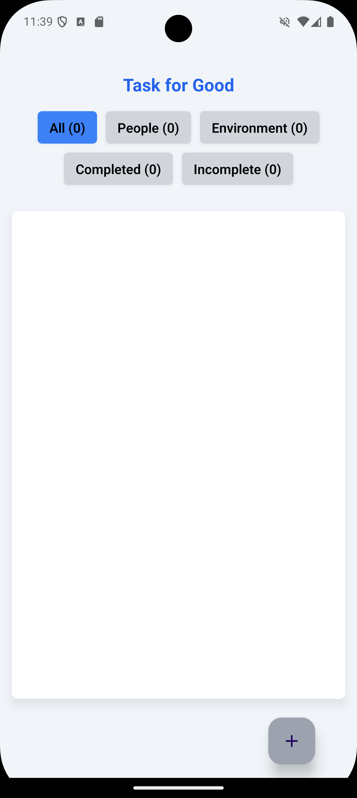
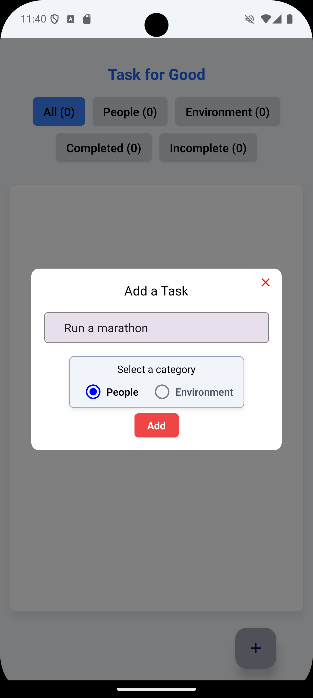
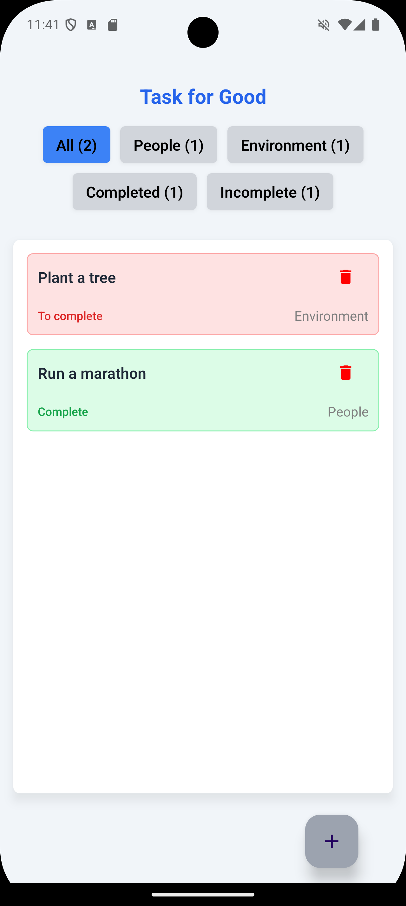

# Task for Good

**Task for Good** is a simple task management app designed to help users track good actions for people and the environment. 

This app was created as part of a React Native course project and focuses on basic task management functionality, with an emphasis on categorizing and filtering tasks.

## Features

- **Add New Tasks**: Create tasks and assign them to one of two categories: **People** or **Environment**.
- **Mark as Completed**: Update tasks to indicate their completion status.
- **Filter Tasks**: View tasks by:
  - Category: **People** or **Environment**.
  - Status: **To Do** or **Completed**.
  - All tasks.
- **Dynamic Counters**: Display the number of tasks in each filter.
- **Modern UI**: Clean, responsive design using **React Native Paper** and **NativeWind** for styling.

## Screenshots

<div style="display: flex; gap: 10px;">
    
    
    
</div>

---

## Installation

1. Clone the repository:
    ```bash
    git clone https://github.com/Pekko1/React-Native-toDo.git
    ```
2. Navigate to the project directory
   
3. Install dependencies:
    ```bash
    npm install
    ```

## Usage

1. Start the development server:
    ```bash
    npx expo start
    ```
2. Open the Expo Go app (iOS or Android) on your device, and scan the QR code displayed in the terminal.
3. Alternatively, run the app on a simulator/emulator using the Expo development tools.

## License

This project is licensed under the MIT License.

## Credits

Task for Good was created by Pekko-GB.
This app was developed as part of a React Native learning project.
